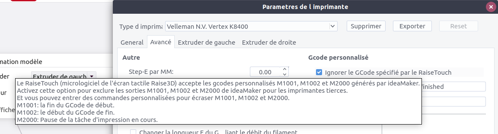

Une liste de g-code que l'on peut rencontrer dans un fichier .gcode ou .gco ou .g mais qui ne sont pas des g-code valide pour un firmware Marlin.

**M1001** Spécifique au RaiseTouch des imprimantes ? et donc a IdeaMaker https://www.ideamaker.io/download.html 
Il faut cocher sous IdeaMaker dans les paramètres du profile de l'imprimante, le truc pour ne pas utiliser les g-code spécifique au RaiseTouch !

